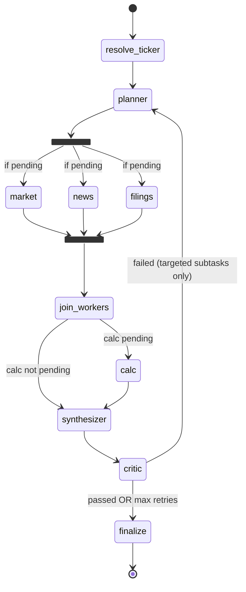

# Architecture — LangGraph multi-agent stock research (India, NSE/BSE)

## End-to-end request path

```
Browser (React + Vite :3000)
   POST /api/v1/research { query }
        ↓
FastAPI (:8000)  →  job record (Redis, or in-memory fallback)
        ↓ background task (420s hard timeout)
LangGraph.stream(query)  →  progress messages update the job live
        ↓
ResearchBrief JSON stored on job (completed)
        ↓
Browser polls GET /api/v1/research/{job_id} every 2s
        ↓
BriefView renders claims + source citations + price chart
```

## LangGraph state machine

Market, news, and filings workers run **in parallel** (fan-out from the
planner). Calc runs after the join because it depends on market data.



Concurrency notes (see `agents/state.py`):

- `sources` and `completed_workers` use `operator.add` reducers so parallel
  workers can append without conflicts.
- `status_message` uses a last-value reducer since parallel nodes may write it
  in the same superstep.
- Workers do NOT write `pending_workers`; routing reads the planner's value.

## LLM usage (exactly 2 calls per job)

| Call | Node | Purpose | Fallback if LLM fails |
|------|------|---------|----------------------|
| 1 | news worker | Batched sentiment + rationale + near/far-term impact for ALL articles in one call | Keyword heuristic (bullish/bearish word lists) |
| 2 | synthesizer | 6–9 sentence analyst summary (performance, valuation, news impact, outlook) | Deterministic summary composed from fetched data |

Provider is set by `LLM_PROVIDER` (default `openrouter`, OpenAI-compatible API
with a `:free` model). Error text is never surfaced in the brief.

## Critic retry contract

Critic emits:

```json
{
  "critic_passed": false,
  "critic_issues": [
    {
      "code": "PE_MISMATCH",
      "message": "Reported P/E 28.1 vs price/EPS 31.4",
      "failed_subtask": "market",
      "claim": "pe_ratio"
    }
  ]
}
```

Planner reads `failed_subtask` values → sets `pending_workers` to **only those
workers** (plus `calc` if `market` retries). Loop capped by
`MAX_CRITIC_RETRIES` (default 2). After exhaustion, brief is force-accepted
with `critic_passed=false` and warning notes.

Checks: P/E consistency (reported vs price÷EPS), citation integrity (every
numeric block cites a known source id), news freshness (≤45 days) and URL
traceability, required sections (summary, last price).

## Worker → tool mapping

| Worker | Tool module | External system |
|--------|-------------|-----------------|
| market | `tools/market_data.py` | yfinance 3y history + fundamentals (+ optional Alpha Vantage fallback) |
| news | `tools/news_search.py` + LLM | Tavily (Indian financial press) + OpenRouter |
| filings | `tools/india_filings.py` | Tavily results/announcements + yfinance earnings calendar |
| calc | `tools/code_exec.py` | Local Python (no LLM math): P/E, YoY revenue, SMA 20/50 |

## File map (services)

```
backend/app/
  main.py                 FastAPI app + CORS + lifespan (+ Ollama warmup when local)
  api/routes/
    health.py             GET /health (redis + active LLM model)
    research.py           POST/GET research jobs (background execution, timeout)
  agents/
    state.py              AgentState TypedDict + reducers for parallel writes
    graph.py              StateGraph: parallel fan-out → join → calc → synth → critic
    planner.py            Decompose + targeted retry
    workers.py            market / news (sentiment+impact) / filings / calc
    synthesizer.py        Draft brief + price_history downsample + LLM summary
    critic.py             Consistency / citation / freshness gates
    runner.py             Sync stream wrapper with progress callback
  tools/                  Pure I/O + calc (no graph logic)
  services/               Redis, LLM factory (openrouter|ollama|openai|anthropic),
                          ticker resolve, job store
  models/schemas.py       API contracts (Pydantic) incl. PricePoint, NewsItem.impact
  core/                   Settings + logging
frontend/src/
  main.tsx                React entry
  App.tsx                 Shell / hero (model name fetched from /health) + footer
  components/             ResearchStudio (quick picks, 2s polling),
                          PipelineStatus (step map), BriefView (perf toggle + SVG chart)
  lib/api.ts              Typed fetch client (VITE_API_URL)
eval/
  tickers_testset.json    Tickers for factual accuracy %
  run_eval.py             Eval metric generator
```

## Current state / possible next steps

Done: OpenRouter free-tier LLM, parallel workers, multi-horizon performance
(1W–3Y) + price chart, sentiment with impact horizon, cleaned filings, critic
gates, targeted retries.

Next candidates:

1. Wire Redis checkpointer on LangGraph for durable job resume
2. SSE progress events → replace frontend poll/guess
3. NSE corporate-announcements API instead of Tavily-scraped filings
4. Run `eval/run_eval.py` → track factual accuracy %
