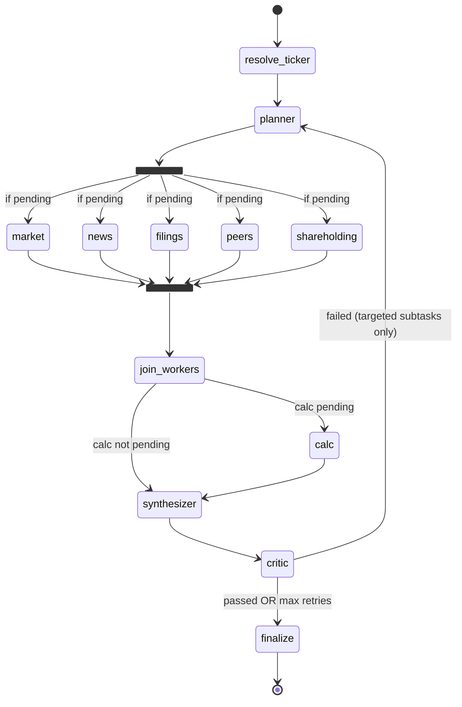

# Architecture — LangGraph multi-agent stock research (India, NSE/BSE)

## End-to-end request path

```
Browser (React + Vite :3000)
   GET /api/v1/search?q=… (debounced, per keystroke — see "Search path" below)
   POST /api/v1/research { query }   ← the symbol the user picked, or raw text
        ↓
FastAPI (:8000)  →  compare-intent detection (regex, LLM fallback)
        ↓            → job record (Redis, or in-memory fallback), mode=single|compare
        ↓ background task (420s hard timeout)
LangGraph.stream(query)  →  progress messages update the job live
        ↓
ResearchBrief (or CompareBrief) JSON stored on job (completed)
        ↓
Browser polls GET /api/v1/research/{job_id} every 2s
        ↓
BriefView / CompareView renders claims + confidence badges + citations
```

## Search path (pre-pipeline)

Search runs entirely outside the graph: it is a read-only lookup that must
answer in milliseconds, while the graph is a multi-minute job. Keeping them
apart means a burst of typing can never queue research jobs.

```
GET /api/v1/search?q=…
        ↓
services/stock_search.py
  1. local catalog     data/nse_universe.json (generated from NSE archives)
     (offline, ~5ms)   + data/stock_aliases.json (curated aliases + brands)
                       signals: exact symbol · exact name · alias · name prefix
                       · initials · every-word match · brand keyword · sector
                       · char-trigram fuzzy (typos)
        ↓ top score < 0.90
  2. Yahoo Finance     BSE-only / newly listed names. Agreement between layers
     search API        is corroboration → +0.05 confidence, same principle the
                       news worker applies to headlines
        ↓ top score < 0.55 AND the query reads like a question
  3. LLM               proposes company NAMES only; each is resolved back
     interpretation    through layer 1 → a hallucinated ticker is structurally
                       impossible. Capped at 0.70 (never "high")
        ↓
[{symbol, ticker, name, exchange, industry, score, confidence, match_reason,
  sources}] — cached 6h per query
```

In the UI the results panel is laid out **in flow** (not as an absolute
overlay), so it can never cover the surrounding controls; it opens only on an
explicit request (typing, or a "Try searching" example) and collapses while a
job runs. Theming is one set of CSS variables → Tailwind tokens, dark by
default, applied before first paint by an inline script in `index.html`.

`resolve_ticker()` reuses layer 1 before its own network lookups, which is what
lets renamed symbols (TATAMOTORS → TMCV/TMPV), curated short forms ("HUL") and
brand names ("maggi") resolve end-to-end. When resolution still fails, the
ranked candidates are attached to the failed job as `suggestions`, so the UI can
offer one-click recovery instead of an apology.

## LangGraph state machine

Five I/O workers run **in parallel** (fan-out from the planner). Calc runs
after the join because it depends on market data.



The two Phase-2 workers (`peers`, `shareholding`) deliberately reuse the
**existing** fan-out/join/retry pattern rather than introducing a second
orchestration style — they are ordinary I/O workers that write their own
state key and append to `completed_workers`.

Concurrency notes (see `agents/state.py`):

- `sources` and `completed_workers` use `operator.add` reducers so parallel
  workers can append without conflicts.
- `sources` is **deduplicated by id** in the synthesizer: `operator.add`
  concatenates across critic retries, so a retried worker's sources would
  otherwise sit alongside the stale first attempt's under the same ids
  (see `docs/AUDIT.md` #3.1).
- `status_message` uses a last-value reducer since parallel nodes may write it
  in the same superstep.
- Workers do NOT write `pending_workers`; routing reads the planner's value.

## Deterministic passes inside the critic

Two pure-logic passes run on **every** critic invocation, before the gates:

1. **Confidence scoring** (`core/confidence.py`) — tags every claim-bearing
   block High/Medium/Low from a fixed rule table.
2. **SEBI-safe language filter** (`core/compliance_filter.py`) — a regex
   rewrite table applied to all free-text fields, emitting an audit log of
   every `input_phrase → output_phrase` change.

Both run even on a force-accepted (max-retries-exhausted) brief — compliance
must never be skipped just because the critic gave up.

## LLM usage (2 calls per single-ticker job)

| Call | Node | Purpose | Fallback if LLM fails |
|------|------|---------|----------------------|
| 1 | news worker | Batched sentiment + rationale + near/far-term impact for ALL articles in one call | Keyword heuristic (bullish/bearish word lists) |
| 2 | synthesizer | 6–9 sentence analyst summary | Deterministic summary composed from fetched data |

Both prose fallbacks are gated by `core/text_quality.py::looks_like_prose`, not
just by "did the model return something". Free models fail by emitting
non-empty gibberish as well as by erroring, and a `if text:` check lets that
straight through to the user (`docs/AUDIT.md` #9.2).

Compare mode adds one call for the side-by-side narrative (and, only for
phrasing the regex can't parse, one cheap intent-detection call).

**No LLM does arithmetic.** P/E bands, QoQ deltas, SMAs, YoY growth, and peer
metrics are all computed in `tools/code_exec.py` / the tool layer.

## Critic retry contract

Critic emits `critic_issues` with a `failed_subtask` per issue; the planner
re-queues **only those workers** (plus `calc` if `market` retries). Loop
capped by `MAX_CRITIC_RETRIES` (default 2) — `retry_count` is read before the
current pass's issues are counted, so the critic runs at most
`MAX_CRITIC_RETRIES + 1` times before force-accepting with
`critic_passed=false` and warning notes.

Checks: P/E consistency (reported vs price÷EPS), citation integrity for
`price_action` / `fundamentals` / `calculations` / every news item / **every
filing** (the filings check was missing entirely — `docs/AUDIT.md` #3.2),
news freshness (≤45 days) and URL traceability, required sections.

## Worker → tool mapping

| Worker | Tool module | External system | On failure |
|--------|-------------|-----------------|------------|
| market | `tools/market_data.py` | yfinance 3y history + fundamentals (+ optional Alpha Vantage) | Raises `MarketDataUnavailable`; worker degrades the section and the brief continues without price data |
| news | `tools/news_rss.py` (primary) + `tools/news_search.py` (supplement) + LLM | ET / Moneycontrol / Livemint / Business Standard RSS; Tavily | Each feed fails independently → contributes 0 articles; all-fail → stub item |
| filings | `tools/india_filings.py` | Tavily results/announcements + yfinance calendar | Returns a stub/N-A entry, never raises |
| peers | `tools/peer_data.py` | Static `data/peer_groups.json` + reused market/calc per peer | Ticker not in map → `available:false` with reason; one bad peer → that row omitted |
| shareholding | `tools/shareholding.py` | NSE shareholding-pattern endpoint via `nsepython` | `available:false` with reason; never blocks or retry-loops the brief |
| calc | `tools/code_exec.py` + `tools/sector_pe.py` | Local Python; NSE `allIndices` for sector P/E | P/E band → `available:false` with reason; sector P/E → static fallback table, then `available:false` |

Every one of those failure modes surfaces in the UI as an explicit
"unavailable" state plus an entry in the brief's `data_gaps` list. **No gap is
ever filled with an estimate.**

## Why each new worker exists (one line each)

- **peers** — a P/E means nothing in isolation; the peer table is what turns a
  number into a judgement. Fails → "Peer comparison not available for this
  ticker yet."
- **shareholding** — a falling promoter stake is the single highest-signal
  governance red flag on an Indian listing. Fails → "Shareholding data
  unavailable this cycle."
- **valuation (inside calc)** — answers "is this expensive *for this stock*
  and *for this sector*", not just "what is the P/E". Fails → band and/or
  sector average each degrade independently.
- **news RSS** — structured, free, high-signal India financial press replaces
  generic web-search snippets as the primary feed. Fails → falls back to
  Tavily, then to a labelled stub.
- **confidence scoring** — makes "verified exchange data" visually distinct
  from "one unconfirmed headline". Cannot fail; pure logic.
- **compliance filter** — deterministic, auditable SEBI-safe rewriting that an
  LLM can't silently drift away from. Cannot fail; pure logic.
- **compare mode** — runs the same pipeline twice concurrently and joins the
  results; no new orchestration pattern.

## Caching

`services/cache.py` — TTL cache, Redis-backed when available, in-memory
otherwise. Applied where staleness is cheap and refetching is wasteful:

| Data | TTL | Why |
|------|-----|-----|
| Shareholding pattern | 7 days | Updates ~4×/year |
| Sector P/E (live) | 1 day | Barely moves intraday |
| Sector P/E (static fallback) | 4 hours | Shorter, so a transient NSE outage doesn't pin us to stale-static data |
| Search suggestions | 6 hours | The catalog only changes on a listing/rename; caching keeps the Yahoo/LLM layers off the hot path |

Live price/news are deliberately **not** cached — staleness tolerance there is
a product decision, not a bug fix.

## File map

```
backend/app/
  main.py                 FastAPI app + CORS + lifespan
  api/routes/
    health.py             GET /health
    research.py           POST/GET jobs; single + compare execution paths
    search.py             GET /search — ranked, scored typeahead candidates
  agents/
    state.py              AgentState TypedDict + reducers
    graph.py              StateGraph: 5-way parallel fan-out → join → calc → synth → critic
    planner.py            Decompose + targeted retry
    workers.py            market / news / filings / peers / shareholding / calc
    synthesizer.py        Draft brief, source dedupe, data_gaps, LLM summary
    critic.py             Confidence + compliance passes, then consistency gates
    compare.py            Two-brief join: metrics table + narrative
    runner.py             Sync stream wrapper; run_research_pipeline / run_compare_pipeline
  tools/                  Pure I/O + calc (no graph logic)
  services/               Redis, cache, LLM factory, ticker resolve, intent, job store,
                          stock_search (catalog + Yahoo + LLM search layers)
  core/                   config, logging, ticker helpers, confidence,
                          compliance_filter, dedup, text_quality
  data/peer_groups.json   Curated NSE peer groups + sector→index map
  data/nse_universe.json  GENERATED search catalog (~2.4k NSE symbols + tier)
  data/stock_aliases.json Curated aliases + brand keywords (hand-maintained)
  scripts/build_stock_universe.py  Rebuilds nse_universe.json from NSE archives
frontend/src/
  index.css               Theme tokens (dark = :root, light = [data-theme])
  lib/theme.ts            Theme read/apply + localStorage persistence
  components/             ResearchStudio, StockSearchInput, ThemeToggle, BrandMark,
                          BriefView, CompareView, ValuationPanel,
                          PeerTable, ShareholdingCard, ConfidenceBadge, TrendIndicator,
                          DataGapBanner, Skeleton, BriefSkeleton, ErrorBoundary, PipelineStatus
  lib/api.ts              Typed fetch client
eval/
  run_eval.py             Factual accuracy + graceful-degradation + coverage metrics
```

## Known follow-ups

1. Full graph integration test with mocked tools (`docs/AUDIT.md` §7.4) — the
   single biggest remaining test gap; nothing currently proves the *wiring*
   (that a critic failure re-runs only the targeted worker through the real
   `StateGraph`).
2. Redis checkpointer on LangGraph for durable job resume.
3. SSE progress events to replace the 2s frontend poll.
4. Per-call explicit timeouts on yfinance (`docs/AUDIT.md` #1.2).
5. FII/DII shareholding (v2) — separate, noisier monthly NSDL data.
